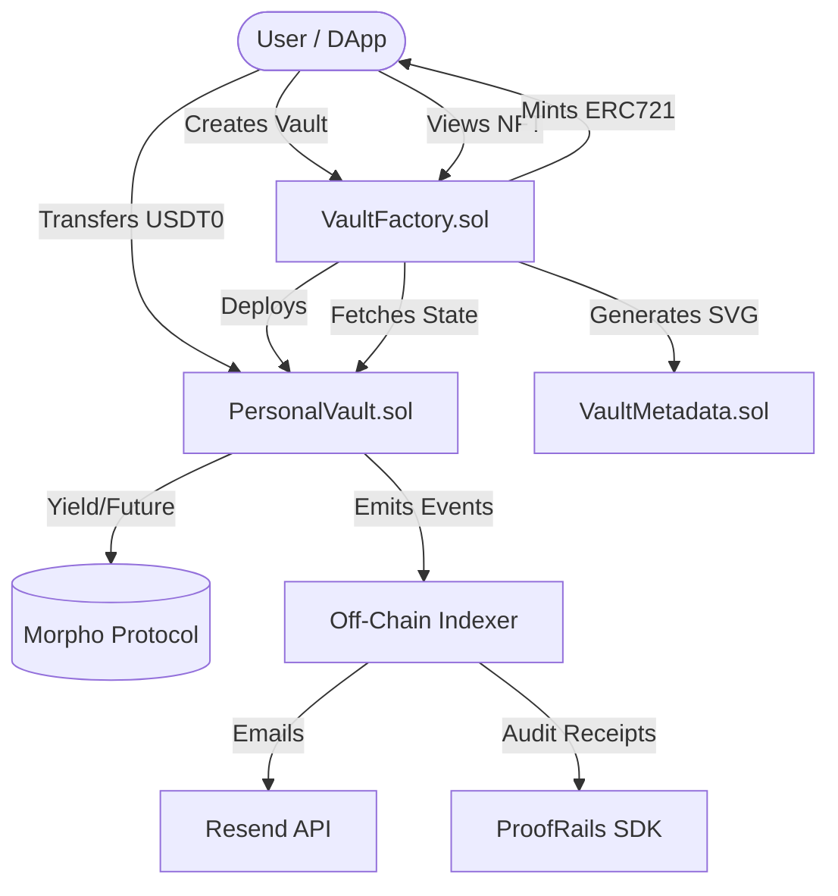
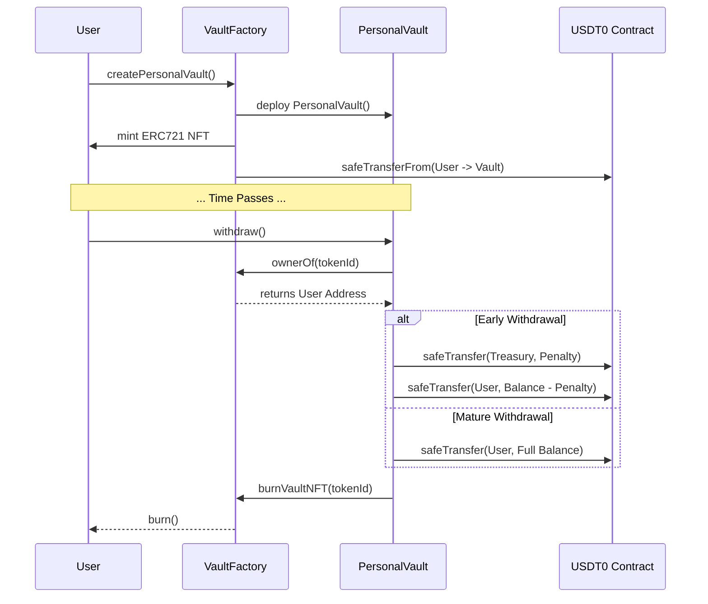

# Savique Protocol: Technical Documentation

## 1. Protocol Overview
Savique is a non-custodial, decentralized savings protocol deployed on the **Flare Network (Coston2 Testnet)**. It enforces financial discipline through smart contract-based time-locks, early withdrawal penalties, and on-chain verifiable audit trails. 

The protocol utilizes a unique **Factory-ERC721-Vault Architecture**, where every savings space is an isolated smart contract (`PersonalVault`), and ownership of that vault is governed by an ERC-721 Non-Fungible Token (NFT) minted by the `VaultFactory`. 

All liquidity in the current deployment is handled using **Flare USDT0 (ERC-20)** to ensure protection against asset volatility, allowing users to hit specific fiat-denominated financial targets.

## 2. Core Smart Contract Architecture

The protocol is built using Solidity (v0.8.20) and heavily relies on OpenZeppelin standards (`SafeERC20`, `ReentrancyGuard`, `ERC721Royalty`, `Ownable`).

### 2.1 `VaultFactory.sol` (The Deployer & Registry)
The Factory contract is the entry point for the protocol. It handles the deployment of individual vaults and the minting of receipt NFTs.
*   **Vault Deployment**: Uses the `new` keyword to deploy instances of `PersonalVault.sol`.
*   **ERC-721 Integration**: Inherits `ERC721Royalty`. Upon vault creation, it mints a unique NFT (`tokenId`) to `msg.sender`. The owner of this NFT is queried by the Vault to authorize deposits and withdrawals. This makes savings vaults mathematically **transferable**.
*   **Auto-Deposit Execution**: Exposes an `executeAutoDeposit` function. If users grant ERC-20 allowances to the factory, the factory admin (or automation nodes) can push funds directly into the user's vault.
*   **Dynamic On-Chain Metadata**: Overrides `tokenURI()` to fetch real-time state from the associated `PersonalVault` (balance, purpose, unlock time) and passes it to `VaultMetadata.sol` to generate base64-encoded SVG and JSON metadata entirely on-chain.

### 2.2 `PersonalVault.sol` (The Vault Instance)
A dedicated contract deployed for each savings goal. It inherits from an `AbstractVault` and implements `ReentrancyGuard`.
*   **ERC-20 Storage**: Securely holds the `Flare USDT0` (`token.safeTransferFrom`).
*   **Access Control**: Implements `onlyVaultOwner` modifier, which calls `IVaultFactory(factory).ownerOf(tokenId)` rather than storing the owner locally.
*   **Time-Lock & Penalty Logic**: 
    *   If `block.timestamp >= unlockTimestamp`: Full balance is withdrawn.
    *   If `block.timestamp < unlockTimestamp`: An early exit penalty (`penaltyBps`) is calculated. The penalty is routed via `safeTransfer` to the `protocolTreasury`, and the remainder is sent to the user.
*   **Auto-Burn Mechanism**: Upon full withdrawal or beneficiary claim, the vault calls `IVaultFactory(factory).burnVaultNFT(tokenId)` to destroy the representative NFT, concluding the vault's lifecycle.
*   **Emergency Beneficiary**: Introduces a `claimByBeneficiary` function, executable by the factory after the `unlockTimestamp + GRACE_PERIOD` (e.g., 365 days in production), preventing permanent loss of funds due to lost private keys.

### 2.3 `VaultMetadata.sol` (On-Chain SVGs)
Generates real-time visual representations of the vault's status (Balance, Target, Maturity Date) as an SVG image, eliminating reliance on centralized IPFS/HTTP metadata hosting.

## 3. Off-Chain Integrations & Infrastructure

### 3.1 ProofRails SDK (Verifiable Audit Trails)
Savique integrates **ProofRails** to provide cryptographically signed, tamper-proof financial receipts. Every on-chain transaction (deposit, withdrawal) triggers a ProofRails signature, allowing users to generate verified financial proofs for external auditors, landlords, or institutions without revealing their entire wallet history.

### 3.2 Professional Notification System
We use the **Resend API** to push critical protocol events via email. This includes:
*   Real-time transaction receipts.
*   Maturity alerts (when `block.timestamp >= unlockTimestamp`).
*   Security alerts if early withdrawal is attempted.
Preferences are mapped off-chain (via Firebase) to maintain anonymity on the ledger.

### 3.3 TVL & Analytics Dashboard
An indexing layer tracks the `PersonalVaultCreated`, `Deposited`, and `Withdrawn` events emitted by the factory and vaults to aggregate Total Value Locked (TVL) and generate Proof of Reserves transparency reports.

## 4. Execution Flows

### Vault Creation & Initial Deposit
1. User calls `createPersonalVault()` on `VaultFactory`.
2. Factory deploys a new `PersonalVault`.
3. Factory mints ERC-721 token to User.
4. Factory executes `IERC20.safeTransferFrom` to move the initial USDT0 deposit from the User to the new Vault address.

### Early Withdrawal Execution
1. User calls `withdraw()` on `PersonalVault`.
2. Contract verifies ownership via `Factory.ownerOf()`.
3. Contract checks `block.timestamp < unlockTimestamp`.
4. Calculates `penalty = (balance * penaltyBps) / 10000`.
5. Transfers `penalty` to `protocolTreasury`.
6. Transfers `balance - penalty` to User.
7. Triggers `Factory.burnVaultNFT()` to destroy the NFT.

## 5. Mainnet Roadmap & Upcoming Features

1.  **Morpho Protocol Integration**: Transitioning idle USDT0 into yield-bearing strategies (e.g., Morpho or native Flare DeFi) to generate interest during the lock-up period.
2.  **Decentralized Automation (Auto-Save)**: Replacing the factory owner auto-deposit execution with a decentralized keeper network (e.g., Chainlink Automation or Gelato) to run DCA (Dollar Cost Averaging) strategies.
3.  **Shared Savings Vaults (Multi-Sig)**: Deploying variant vaults that require n-of-m signatures or allow pooled community contributions.
4.  **Advanced ZK Proofs**: Enhancing ProofRails with Zero-Knowledge proofs to prove financial solvency without revealing exact numerical balances.

## 6. Deployment & Testing

*   **Network**: Flare Coston2 Testnet
*   **Factory Contract**: [`0x4E70a85B1553ef34128C13C52B81A5862e4A11Dc`](https://coston2-explorer.flare.network/address/0x4E70a85B1553ef34128C13C52B81A5862e4A11Dc)
*   **Token**: Flare USDT0 (ERC-20)
*   **Repository**: [GitHub Link](https://github.com/Elite-tch/Savique/tree/ship)
*   **Live DApp**: [https://testnet.savique.xyz/](https://testnet.savique.xyz/)
